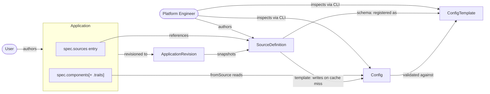
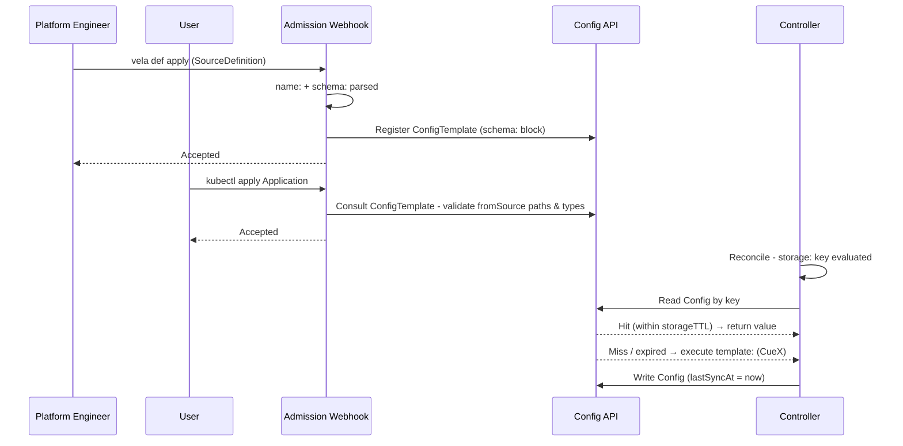
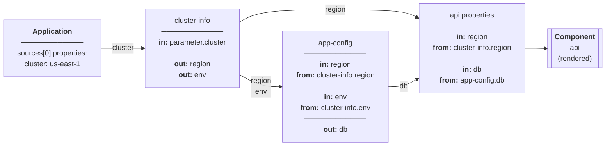
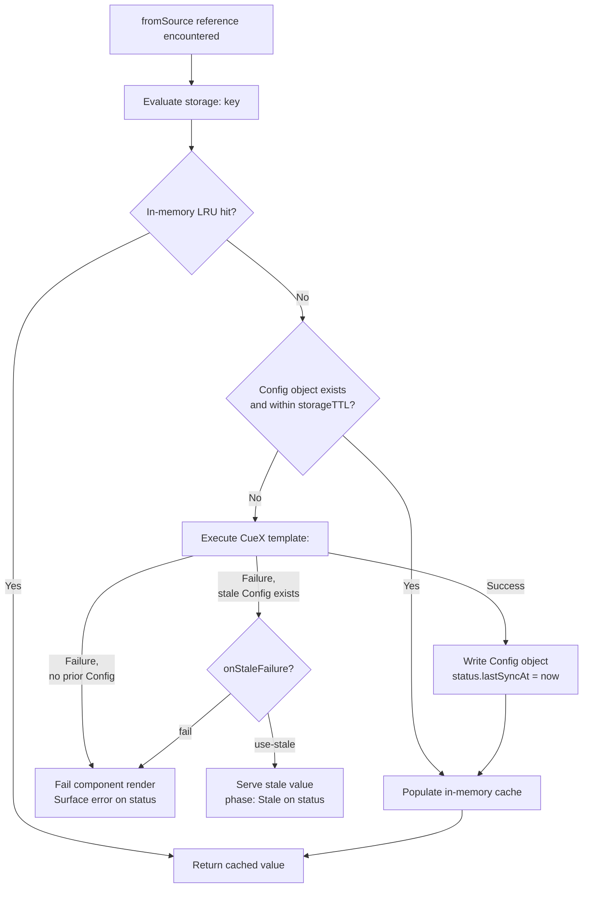

# KEP-2.16: SourceDefinition & fromSource

**Status:** Ready for Review
**Parent:** [vNext Roadmap](../README.md)

`SourceDefinition` and `fromSource` introduce a four-layer model for declarative data resolution:

| Layer | Artefact | Author | Responsibility |
|---|---|---|---|
| Definition | `SourceDefinition` | Platform engineer | Declares the output schema, cache key, and resolution logic |
| Binding | `spec.sources[]` | Application author | Names a `SourceDefinition`, scopes it to this Application, supplies instance properties |
| Resolution | `Config` object | Controller | Evaluates the cache key, serves a cached value or executes `template:`, writes result |
| Consumption | `fromSource` directive | Application author | Declares which resolved field goes into which property; substitution occurs before the component's CUE template runs |

Today, retrieving external data requires workflow steps and manual data passing (exposing orchestration concerns to application authors for what should be a static, declarative lookup). `SourceDefinition` eliminates that exposure: the application author declares *what* data they need and *where* it goes; the platform controls *how* it is fetched and *when* it is cached.

**Trust boundary:** The platform engineer and the application author operate at different trust levels. A `SourceDefinition` carries arbitrary CueX logic (it can make HTTP calls, read cluster resources, and write resolved values into the controller's cache). Authoring and publishing a `SourceDefinition` is therefore a high-trust operation, equivalent in scope to writing a `ComponentDefinition`. The application author's trust is deliberately narrower: they can bind a named `SourceDefinition` and supply properties, but they cannot alter its resolution logic, access fields outside its declared `schema:`, or read raw resolution state. This separation is load-bearing; the feature's security properties depend on it.



## Amendments

The body below is the original design. Implementation and review since then have
changed parts of it. Rather than rewrite the document and lose the reasoning, each
change is recorded here as an amendment, with what it supersedes and why. Sections
affected carry a pointer back to this list.

| # | Amendment | Supersedes | Status |
|---|---|---|---|
| A1 | The cache key is inferred from the template, not authored | [Cache Key](#cache-key) | implemented |
| A2 | Generated fields live in `$internal:`; `storage:` is authored-only and optional | [Cache Key](#cache-key), [SourceDefinition Authoring Model](#sourcedefinition-authoring-model) | implemented |
| A3 | Cache identity is a readable prefix plus a hash of every resolution input | [Cache Key](#cache-key) | implemented, closes finding #11 |
| A4 | A source may read only the context that is part of the key | [CUE Context in SourceDefinition](#cue-context-in-sourcedefinition), [Future Enhancements](#future-enhancements) | implemented |
| A5 | Cache entries carry their identity as labels and annotations | [Operator Guidance](#operator-guidance-inspecting-cache-state) | implemented |
| A6 | A property may be a CUE expression; `fromSource` is no longer the only consumption mechanism | [fromSource Semantics](#fromsource-semantics), [Application Usage](#application-usage) | implemented |
| A7 | Expressions resolve on workflow steps, and on every policy for `context` only | [fromSource Semantics](#fromsource-semantics), [Future Enhancements](#future-enhancements) | implemented |
| A8 | The author/platform boundary is widened, and held by a sandbox rather than by having no language | [Trust Model](#trust-model) | implemented |
| A9 | `// +sensitive` covers every field beneath the one it marks | [Controller Guarantees](#controller-guarantees) | implemented |
| A10 | `fromSource` is removed; expressions are the only consumption mechanism | [fromSource Semantics](#fromsource-semantics), [Application Usage](#application-usage) | implemented |
| A11 | Every surface type-checks its expressions, not just components and traits | [Validation summary](#validation-summary) | implemented |

**Reading the worked examples below.** Every example in the body writes its key by
hand, as `storage: { key: "..." }`. Applied as written, all of them would now be
rejected at admission. Read them as illustrations of *what the key expresses* —
which is unchanged — not of how it is written. The equivalent today is to omit the
key entirely and let `vela def` generate the `$internal:` block; the expression it
produces is the same one the example states, provided the template genuinely reads
the context the example's key interpolates. Where it does not, the example was
already describing a cache scope its template did not have, which is the class of
error A1 exists to remove.

### A1: The cache key is inferred, not authored

**Was:** `storage.key` was a mandatory CUE expression written by the definition
author. The KEP's own guidance ran to several paragraphs: include every
discriminating input, normalise anything containing illegal characters, choose the
narrowest correct scope.

**Is:** the key is generated. `vela def` scans the template for `context` reads,
orders them by policy, and writes the resulting expression into the definition.
Admission re-derives it and rejects a mismatch.

**Why.** The original design made the sharing boundary an author's obligation, and
got no feedback when they got it wrong. The failure was silent and severe: a key
that omitted a discriminating input meant the second Application to resolve
received the first's data, and nothing in the system objected. The KEP acknowledged
this ("the key must discriminate on whatever changes the output") but could only
state it as a rule to follow, not enforce it.

Inference removes the obligation. Everything the template reads is in the key by
construction, so the class of bug the guidance warned about cannot be written.

The author keeps the choice that mattered: a source reading `context.cluster` is
keyed per cluster; one reading nothing is shared everywhere. That is decided by
what the template reads, which is the honest signal — the previous design let the
key and the template disagree.

**What this costs.** An author can no longer widen the cache deliberately (read a
value but exclude it from the key). No use for that has come up, and it is exactly
the operation that produced the silent-sharing bug, so it is withheld rather than
supported.

A key already present is accepted when it matches and rejected when it does not,
rather than being overwritten. That is what lets `vela def get`, edit, apply
round-trip, and it keeps an author's belief about how their source is cached from
being silently corrected.

### A2: Generated fields live in `$internal:`

**Was:** `storage: {key, storageTTL, onStaleFailure}` — one block holding both
generated and authored fields.

**Is:**

```cue
// Generated from the context this template reads - do not edit.
$internal: {
	key:       "tenant-data-\(context.cluster)-\(context.namespace)"
	keyInputs: ["cluster", "namespace", "appLabels[region]"]
}

storage: {
	storageTTL:     "15m"
	onStaleFailure: "use-stale"
}
```

**Why.** With A1, `storage:` held two kinds of field with opposite rules, and
nothing distinguished them. That is not hypothetical: a demo manifest in this repo
carried a wrong hand-written key precisely because it sat beside `storageTTL` and
looked equally authorable.

Splitting them means the reader needs no knowledge at all — one block is theirs,
the other is not. `storage:` keeps its name because it says *what* it configures,
and becomes optional: a source with no caching preferences now declares nothing.

**On the `$` prefix.** It follows the convention CueX already uses for `$params`
and `$returns`. A leading underscore would be the CUE idiom for "internal", but
hidden fields are dropped from exported output and these must stay visible —
GitOps diffs them and admission re-derives them. `__` is reserved by CUE outright
and does not compile.

**`keyInputs` is validated alongside the key, and matters more.** Only some fields
are inlined into the key expression, so a hashed-only input can be deleted by hand
while the key still validates perfectly — collapsing every value that input
distinguished onto one cache entry. Both are re-derived at admission.

### A3: Cache identity is a prefix plus a hash

**Was:** the resolved `storage.key` *was* the Config object name, and the KEP put
the burden of making it a legal name on the author — including a worked example
using `strings.Replace` to normalise an image reference.

**Is:** the identity is `<readable prefix>-<hash>`. The prefix is the generated key
expression and is cosmetic. The hash covers a structured document: the template's
fingerprint, the binding's properties, and exactly the context values named by
`keyInputs`.

**Why the split.** Uniqueness lives in the hash, which frees the prefix from having
to carry it. Three things follow:

- **Normalisation stops being the author's job.** A value that cannot be rendered
  into a legal object name — a struct, a label value containing `/` or `.` — simply
  contributes to the hash and not the prefix. The `strings.Replace` guidance in the
  body is obsolete.
- **Absent, empty, and set are three different identities.** The hash is a
  structured document, so `nil`, `""` and `"platform"` are distinct. A template can
  branch on that difference (`if context.appLabels["team"] != _|_`), so the identity
  has to draw it too.
- **Over-long identities trim the prefix, never the hash.** A shorter prefix cannot
  collide; re-hashing the whole name would discard readability exactly when the name
  is longest.

**The template fingerprint closes finding #11.** Cached values are served without
re-validation, so a definition whose fetch logic changed must stop addressing the
entries its previous version produced. A schema hash alone would miss the case that
matters — a changed URL behind an unchanged output shape. Because the whole
template is hashed, an edit of any kind orphans the old entries.

Only what the template actually reads is hashed. `keyInputs` is the exact set
`Infer` found, so a field nobody reads is never fetched and never contributes —
cardinality is unchanged from A1.

**Two examples in the body diverge visibly.** Running inference over them:

| Example | Body's hand-written key | Inferred |
|---|---|---|
| `cluster-config-reader` | `"cluster-config-reader-\(context.cluster)"` | identical |
| `backstage-component` | `"backstage-component-\(parameter.entityRef)"` | `"backstage-component"`, properties in the hash |
| `governance-metadata` | `"governance-\(context.appLabels[...])-\(context.cluster)"` | `"governance-metadata"`, labels in the hash |

Sharing behaviour is unchanged in all three — a property or a label that moves from
the prefix to the hash still separates entries. What changes is readability: the
name no longer shows the discriminator. That is the deliberate trade in A3, because
neither an entity reference nor a label value is guaranteed to be a legal object
name, and requiring the author to normalise them was the cost the old design paid.

**One documented behaviour is genuinely withdrawn.** The `governance-metadata`
example states that if `example.org/service-name` is absent, key computation fails
fast, "enforcing the labelling convention at resolution time". It no longer does.
An absent label is a distinct identity, not an error — because a template may
legitimately branch on absence:

```cue
someVar: "bar"
if context.appLabels["team"] != _|_ { someVar: "foo" }
```

Failing on absence would make that template unusable, so absence is hashed as
distinct from empty and from any value. Enforcing a labelling convention is a
policy concern and belongs in admission or a `errs:` check in the definition, not
in cache-key computation.

### A4: A source reads only keyed context

**Was:** a source was compiled against the component's context, and the KEP listed
the fields available.

**Is:** a source is compiled against a context built from the key policy alone.
A field that would not contribute to the key is *absent*, so it cannot be read even
where admission is disabled. Reading anything else fails admission with a single
message: additional data reaches a source as a property instead.

**Why.** With A1, the key covers what the template reads. The converse has to hold
too, or a template could depend on a value the key ignores — reintroducing the
silent-sharing bug through a different door. Restricting the context makes the
invariant structural rather than a rule to check.

**`context.name` is the `spec.sources[]` binding entry**, not the consuming
component. This resolves the hazard recorded under Future Enhancements: the concern
was that `context.name` means different things in a component render versus a
workflow-step render, so a key interpolating it would split one logical entry in
two. Binding it to the source entry makes it stable across every surface, and
removes the need for the proposed `context.componentName`.

Consumer identity is not readable at all. Where a source genuinely needs to know
who is asking, that is passed as a property — explicit at the binding, and part of
the identity like any other property.

### A5: Cache entries carry their identity

**Was:** entries were opaque `<key>-<hash>` Secrets, inspected via `vela config`.

**Is:** each entry records its identity inputs on itself.

```yaml
labels:
  sourcedefinition.oam.dev/name: tenant-lookup
  sourcedefinition.oam.dev/ctx.cluster: local
  sourcedefinition.oam.dev/ctx.namespace: meta-demo
  sourcedefinition.oam.dev/ctx.appLabels.region: eu-west
annotations:
  sourcedefinition.oam.dev/key-inputs: ["cluster","namespace","appLabels[region]"]
  sourcedefinition.oam.dev/context: {"cluster":"local","appLabels":{"region":"eu-west"}}
  sourcedefinition.oam.dev/properties: {"fallback":"unknown"}
  sourcedefinition.oam.dev/template-hash: 14f35523
```

**Why only identity inputs.** An entry is shared by every binding that resolves to
it, so anything outside the identity — the consuming Application, say — differs
between those sharers, and recording it would describe whichever one happened to
write the entry first. Identity inputs are invariant across sharers by
construction, and are also exactly what is worth filtering on.

**Why the split across labels and annotations.** Labels are selectable but
constrained to 63 characters of a restricted alphabet, so only context values that
are legal as both a label key and a label value become labels — an index like
`example.org/service-name` would put a second slash in the key. Annotations carry
everything, so skipping a label loses selectability and nothing else. Emitting an
illegal label would be far worse: the write fails and the entry never persists.

**Resolved output is deliberately not recorded.** Encryption-at-rest covers a
Secret's `data` but not its labels and annotations, so mirroring output into
metadata would quietly defeat it — and output is what `// +sensitive` protects.
Properties are different: they are already plaintext in the Application spec, so
recording them exposes nothing new. Oversized properties are clamped per value
rather than by clipping the finished JSON, so the annotation always parses.

**Open follow-up.** The body states that Configs are inspected through `vela config`
rather than `kubectl`. These labels make selector filtering possible, but
`vela config list` does not yet expose it; surfacing label selectors there would
keep the documented CLI the complete answer.


### A6: A property may be a CUE expression

**Was:** `fromSource` was the only way to consume a resolved value — a directive
naming a source and a path, optionally with a `default`. It yielded a whole value
or nothing.

**Is:** a property may also be a CUE expression, delimited by `$( )`:

```yaml
image:            '$(source.catalog.image + ":1.25.0")'   # concatenation
replicas:         '$(source.tenant.maxReplicas div 2)'    # integer arithmetic
port:             '$(source.catalog.httpPort)'            # stays an int
labels:           '$(source.catalog.standardLabels)'      # a struct, whole
value:            '$(*source.registry.mirror | "none")'   # default
value:            '$(context.appName + "." + context.namespace)'
value:            'https://$(source.registry.host)/health' # embedded in text
```

`fromSource` is unchanged and still supported. `$$(` escapes the delimiter.

**Why.** `fromSource` could *name* a value but not compute with one. Concatenating
a tag onto an image, halving a granted quota, or building a hostname from two
fields each required a bespoke `WorkflowStepDefinition` — written, installed and
maintained per platform — or was hardcoded and left to drift. Three of those
operations were not expressible at any price: a trait cannot receive a workflow
input, an Application-scoped policy renders before any workflow runs, and
`context` is unavailable in an Application's properties at all.

**What makes this more than string interpolation.** The expression is type-checked
at admission against the parameter it feeds. The source's `schema:` is
materialised into concrete sentinel values of the declared kinds, the expression
is evaluated against those, and the resulting kind is compared with the
consuming parameter's declared type. The schema supplies the types; the sentinel
only makes the evaluator willing to run, because CUE will not compute on a
non-concrete operand.

| Written | Rejected at admission with |
|---|---|
| `port: '$(source.catalog.image)'` | *is string but component "webservice" parameter expects int* |
| `image: '$(source.catalog.standardLabels)'` | *is object but … expects string* |
| `image: '$(source.catalog.standardLabels)-x'` | *cannot be combined with text* |
| `image: '$(source.registry.mirror)'` | *may be absent and feeds required … supply a default with `*… \| <fallback>`* |
| `image: '$(source.registry.nope)'` | *not declared in the source's schema* |
| `image: '$(parameter.image)'` | *unknown identifier "parameter"* |

The optional-field rule is the same one the [validation summary](#validation-summary)
states for `fromSource`, and is target-aware in the same way: a default is
required exactly when a possibly-absent read feeds a *required* parameter.

**What this costs.** Soundness requires that an expression's result type be a
function of its operands' types and never of their values, so the grammar is
restricted — no conditionals, no comparisons, no function calls, and exactly one
disjunction, the default. Anything whose type could depend on data that does not
exist at admission is refused rather than typed by guess. This is also what makes
the sandbox in [A8](#a8-the-trust-boundary-is-widened-deliberately) enforceable.

The reach is genuinely wider than `fromSource`: an application author can now
express logic over platform data. That is the point, and it is a real change to
the trust model rather than a convenience — recorded as [A8](#a8-the-trust-boundary-is-widened-deliberately).

### A7: Expressions resolve on more surfaces than `fromSource` did

**Was:** consumption was valid in component properties, trait properties, and a
later `spec.sources[]` entry (chaining). Policies and workflow steps were
explicitly excluded, and extending to them was a [Future Enhancement](#future-enhancements)
blocked on a `context.name` hazard.

**Is:**

| Surface | `fromSource` | `$( )` reading `source` | `$( )` reading `context` |
|---|---|---|---|
| Component properties | yes | yes | yes |
| Trait properties | yes | yes | yes |
| Later `spec.sources[]` (chaining) | yes | yes | yes |
| Workflow step properties | yes | yes | yes |
| Policy properties (any policy) | no | **no** | **yes** |

**Why workflow steps became available.** The blocker the Future Enhancement
described — `context.name` meaning the component in one render and the
application in another, silently splitting one cache entry in two — was closed by
[A4](#a4-a-source-reads-only-keyed-context). `context.name` is now the
`spec.sources[]` binding entry, stable on every surface, so the proposed
`context.componentName` is unnecessary.

**Why a policy gets half the feature.** An Application-scoped policy renders
*before* the appfile exists, so there is no parsed `spec.sources[]` to resolve
against. Every other policy is consumed outside any component render — the
`deploy` provider, the placement lookup and override configuration all read
`af.Policies` directly — so there is no resolver to reach a source through
either. In both cases `context` is available and `source` is not, so permitting
`context` and withholding `source` lets the surface carry expressions at all,
rather than being excluded because half the feature cannot work there.

Both kinds substitute, but in different places, because they render at different
times: an Application-scoped policy in its own render path, every other policy in
a pass over `af.Policies` as the appfile is built. That pass writes a fresh
properties object rather than into the one the Application spec shares, so a
round-trip does not rewrite the author's expression.

**This was initially wrong in a way admission could not catch**, and it is worth
recording as the failure mode rather than just the fix. Admission permitted
`context` in *every* policy, while only Application-scoped policies substituted
it. A topology policy written

```yaml
- name: place
  type: topology
  properties:
    namespace: '$(context.namespace)'
```

was accepted at apply and then failed at deploy with
`namespaces "$(context.namespace)" not found` — the expression used verbatim as a
name. Two enforcement points disagreeing about a surface is exactly the class of
bug that `resolvingSurfaces` exists to prevent for `fromSource`; expressions had
no equivalent single list, and one enforcement point silently did less than the
other promised.

Reading `source` there is **rejected with a reason** rather than silently
substituted with nothing:

```
"source" cannot be read here; this surface permits "context"
```

That is the general rule and not a special case: each surface declares which
roots it permits and which context fields it exposes, and admission types the
expression against that surface's schema. Typing an Application-scoped policy's
expression against a component's context would accept fields the surface never
receives.

**Still outstanding.** Resource-rendering policies *would* resolve today — they
render through the same engine as components, so the resolution path already runs
— but the surface is one boolean covering both policy kinds, and
Application-scoped policies genuinely cannot resolve sources. Enabling them needs
a scope-aware admission check that looks up the `PolicyDefinition` and refuses
only `scope: Application`.

### A8: The trust boundary is widened, deliberately

**Was:** the [Trust Model](#trust-model) rested on the application author having
no language. They could "bind a named `SourceDefinition` and supply properties,
but cannot alter its resolution logic, access fields outside its declared
`schema:`, or read raw resolution state" — and the KEP contrasts this favourably
with workflow-step data passing, where the author had "unconstrained access".

**Is:** the author can now write expressions over resolved data. Two of those
three constraints are untouched — the schema still bounds what is readable, raw
resolution state is still unreachable, and resolution logic is still
platform-only. What changes is that computation over the readable set is now the
author's.

**Why state it rather than let it arrive sideways.** The KEP calls the
platform/author separation load-bearing, so a change to it belongs in the
document rather than in a commit message. The separation still holds, but the
line has moved: it is no longer *"the author has no language"*, it is *"the
author has a language that cannot escape the schema"*.

**What holds it now.** The sandbox is structural, not advisory:

| Property | Enforced by |
|---|---|
| Only `source` and `context` are reachable; no `parameter`, no imports | Grammar walk over the parsed expression |
| Only the surface's permitted roots and declared context fields | Per-surface context schema |
| Only fields the source's `schema:` declares | Type check against the schema's sentinel |
| No I/O, no provider calls, no function calls of any kind | Grammar walk |
| The scope is built from Go data, never concatenated as CUE text | `buildScope` encodes via JSON |

That last row is a correctness property rather than a style preference. Binding
names and label keys come from the Application spec, so they are
attacker-controlled if the author is hostile; a name like `a": {pwned: "yes"}, "b`
concatenated into CUE source would inject fields into the scope, and the failure
would be silent because the injected fields would simply be there. Encoding the
data means a name can only ever be a key. It has its own regression test.

**What this costs.** An author can now construct a value the platform did not
anticipate — `source.a.host + source.b.path` — from fields the platform did
publish. That is a wider capability than `fromSource` and the honest framing is
that it is a deliberate trade, not an unchanged model: the platform still decides
what exists and what is readable, and no longer decides what may be computed from
it.

### A9: `// +sensitive` covers what sits beneath it

**Was:** the [Controller Guarantees](#controller-guarantees) table states that
"sensitive fields are redacted from `status` and logs". The implementation matched
consumed paths against the marked set *exactly*.

**Is:** a marker covers the field it names and every field beneath it, matched on
path segments.

**Why.** A marker can only be written where a schema declares a field. A source
exposing an open struct — `properties: _`, whose shape is whatever produced it —
has nowhere to put one except on the struct itself, so exact matching redacted a
read of `properties` while publishing `properties.token` in the status beside it.
That is precisely the case the marker exists for.

The prefix is a path segment, not a string prefix: `propertiesExtra` is a
different field and is not covered.

**Where it bit.** The `vela-config` source in the shipped library returns a
Config's `properties`, which are the *inputs* its ConfigTemplate took — and for a
credential-bearing template those inputs are the credential. The `image-registry`
template shipped with KubeVela declares `sensitive: false` and takes
`auth.password` among its parameters, so `ReadConfig`'s own guard never fires for
it. `properties` is marked `// +sensitive` there, which only means anything with
this amendment.


### A10: `fromSource` is removed

**Was:** two consumption mechanisms — the `fromSource` directive described in the
body, and the expressions of [A6](#a6-a-property-may-be-a-cue-expression)
alongside it.

**Is:** one. Every consumption is an expression:

```yaml
image:     '$(source.catalog.image + ":1.25.0")'
region:    '$(source.clusterInfo.region)'          # was fromSource: clusterInfo.region
costCentre: '$(*source.tenant.costCentre | "unassigned")'   # was the map form's default:
```

The `FromSource` and `SourceSelector` API types are gone with it. Nothing had
shipped — none of this feature is on `master` — so no Application could exist
that used the directive, and there was no compatibility debt to weigh.

**Why.** Not elegance: two mechanisms meant two enforcement paths, and they had
already drifted once. `fromSource` had `resolvingSurfaces` as its single source of
truth for where it resolved; expressions grew separate surface handling in the
webhook. That divergence is precisely how admission came to accept
`$(context...)` in every policy while only Application-scoped policies
substituted it — one path silently doing less than the other promised, found by a
cluster and not by a test.

Expressions were also a strict superset. Whole structs and lists substitute,
`default:` maps onto `*x | y`, paths are schema-checked, `+sensitive` tracking and
dependency ordering both run off the same `References` — and expressions add what
the directive never had: result-type checking against the consuming parameter,
concatenation, arithmetic, and `context`.

**What this costs.** A hyphenated binding is uglier, and kebab-case is the
Kubernetes norm:

```yaml
fromSource: cluster-info.region        # was
'$(source["cluster-info"].region)'     # is
```

The binding name is the author's own choice in `spec.sources[].name`, so it is
avoidable, and the hyphen-hazard check already explains the bracket form rather
than letting `source.cluster-info` parse as subtraction. It remains the honest
argument for having kept the directive.

**What removal deleted rather than moved.** Two things worth recording, because
both were holes the directive had cut:

- `pkg/appfile/validate.go` **skipped schematic validation entirely** for any
  component or trait whose properties contained a directive, because a raw
  `{fromSource: ...}` node cannot be type-checked against a CUE template. That
  escape hatch is gone; expressions substitute before the template runs, so those
  components are now validated like any other.
- The admission webhook reported the same mistake twice — once from the reference
  pass, once from the type pass — for an undeclared source or an unknown schema
  path. The reference pass now records which properties it faulted and the type
  pass skips them.

**What removal exposed.** Routing every read through the reference pass for the
first time showed its schema lookup had never handled three shapes the library's
own sources use. All three are ordinary reads that `TypeOf` checks properly, and
all three were being rejected as undeclared:

| Read | Shape |
|---|---|
| `labels["platform.io/team"]` | a key containing a dot — every domain-prefixed label |
| `traits.scaler.healthy` | a key of an open map (`[string]: {...}`) |
| `properties.endpoint` | below an open field (`properties: _`) |

The dotted path a reference carries cannot express the first, so opacity is
recorded at collection time while the segments are still separate. The other two
are lookup fixes: fall through to the map's pattern constraint, and stop at an
open field rather than descending into one.

None of these were caught by the unit suites. They were caught by applying the
shipped source library to a cluster, which is the argument for keeping that
library exercised against a real API server rather than only in envtest.


### A11: Every surface type-checks its expressions

**Was:** the type check ran for components and traits only. A mismatch anywhere
else was caught incidentally or not at all - a workflow step by JSON
unmarshalling, naming a Go struct field; a policy by the dry-run render, naming a
CUE path; and the "a possibly-absent read needs a default" rule did not run on
either.

**Is:** policies and workflow steps are typed against their own definition's
`parameter:` block, with the roots that surface permits - `context` only for a
policy, both for a step:

```
spec.workflow.steps[0].properties.parallelism: type mismatch: expression
  $(source.env.name) is string but workflow step "deploy" parameter expects int

spec.policies[0].properties.keepLegacyResource: type mismatch: expression
  $(context.appName) is string but policy "garbage-collect" parameter expects bool

spec.policies[0].properties.owner: context.appLabels.owner may be absent and
  feeds required policy "cost-tag" parameter; supply a default with
  *context.appLabels.owner | <fallback>
```

**Why it had not been running.** Not an oversight in the loop - the target
parameter could not be loaded. `loadTargetParameter` compiled the *whole*
definition template, which requires every package it imports to be registered
with the compiler in hand, and that compiler carries the workload providers, not
`vela/multicluster` or `vela/builtin`. So every workflow-step definition failed to
compile, the check failed open, and it did so silently at `klog.V(4)`.

Only the `parameter:` block is ever wanted, so only that is compiled now - lifted
out of the template with its top-level definitions and compiled alone, with the
full-template compile kept as a fallback. That makes the check independent of
which providers the compiler happens to hold, which also fixes it for any
component definition importing a package this compiler does not have.

**A correction, recorded because the first version of this amendment was wrong.**
It claimed an expression in a workflow step only substitutes into a string field.
That is not true, and a cluster showed it: `replicas: '$(source.num.count div 2)'`
into `apply-deployment`'s `replicas: *1 | int` resolves to 3 and applies. Typed
substitution works, because a CUE-based step's properties stay a `RawExtension`
until after substitution, exactly as a component's do.

The real limitation was one step. `LoadExternalPoliciesForWorkflow` strict-decodes
`deploy` - and only `deploy` - into a Go struct while the appfile is built, to
find the policy names it references. An unsubstituted expression is still a
string at that point, so `parallelism: '$(...)'` was rejected before anything
could resolve it, whatever it would have evaluated to.

That decode is now lenient about *types* while staying strict about *field
names*: it falls back only when the properties carry an expression, and decodes
into a shadow struct with the same JSON names and `json.RawMessage` types, with
`DisallowUnknownFields` still set. The first attempt dropped the field check
along with the type check, which let `policys:` through whenever any expression
was present - caught by testing the typo case rather than only the happy path. A
test pins the shadow struct to `DeployWorkflowStepSpec` so a field added to one
and not the other fails loudly.


## Mental Model

**`SourceDefinition`: reusable source provider (platform engineer)**

A `SourceDefinition` declares how to fetch a piece of external data. Its `template:` block is CueX logic (it can make HTTP calls, read cluster resources, or do any I/O the platform engineer specifies). The controller executes this logic when it needs a fresh value. Application authors never see or modify it.

**`spec.sources[]`: application binding (application author)**

Binds a named `SourceDefinition` to this Application, gives it a local alias, and supplies instance-specific properties. The admission webhook validates the binding at apply time; the `SourceDefinition` must exist, the properties must conform to its schema, and all `fromSource` paths referencing this source must be valid. No data is fetched at this point.

**`fromSource`: consumption (application author)**

Substitutes a resolved field value into a component or trait property, just before that component's rendering template runs. The rendering template (in the `ComponentDefinition`) receives a concrete value; it does not perform resolution itself.

**How it fits together**

When the controller processes a component that uses `fromSource`, it resolves the required sources before the component's CUE template runs (checking the cache, and executing the `SourceDefinition`'s `template:` only on a cache miss or expiry). Once the resolved values are substituted into the component's properties, the rendering template runs against those concrete inputs. I/O is bounded by the cache: on a cache hit, no external calls occur at all.

```
spec.sources declares:  "use SourceDefinition X with these properties"
fromSource declares:    "put field Y from source X into this property"

At reconcile time, before the CUE template runs:
  controller checks cache for X
    → stale or missing: executes SourceDefinition template: (I/O) → writes cache
    → fresh: uses cached value
  substitutes resolved field Y into the property
  component CUE template runs with concrete inputs
```

**What this means in practice**

- All I/O is in the `SourceDefinition`'s `template:` block, executed by the controller on cache miss or expiry. Application authors declare what they need; the platform controls how and when it is fetched.
- Admission validates every `fromSource` path against the `SourceDefinition`'s declared schema at `kubectl apply` time. Invalid paths are rejected before any resolution occurs.

## KubeVela Config and ConfigTemplate

`SourceDefinition` builds on two existing KubeVela platform primitives. Both are live features, managed by `pkg/config/factory.go` and surfaced through the `vela config` and `vela config-template` CLI commands.

**ConfigTemplate:** an existing schema registry entry. Each ConfigTemplate is a Kubernetes ConfigMap in `vela-system`, named `config-template-<name>`, labelled `config.oam.dev/catalog: velacore-config`. Its `data.schema` field holds an OpenAPI3 schema describing the shape of a valid Config; its `data.template` field holds the CUE rendering logic used to produce one. `SourceDefinition` registers its `schema:` block as a ConfigTemplate on install (hash-versioned to avoid duplicates on schema-identical upgrades).

**Config:** an existing resolved-value store. Each Config is a Kubernetes Secret in `vela-system`, labelled `config.oam.dev/catalog: velacore-config` and `config.oam.dev/type: <template-name>`. Its `data.input-properties` field holds the YAML-serialised resolved output, validated against the referenced ConfigTemplate's schema. `SourceDefinition` uses Config objects as its cache: one Config per unique `storage:` key, written on first resolution and refreshed on TTL expiry. This KEP introduces the annotation `config.oam.dev/last-sync-at` on these Secrets to record when the entry was last successfully written; the controller uses this to evaluate freshness against `storageTTL`.

Both are identified by the `config.oam.dev/catalog: velacore-config` label, not by Kubernetes object type. They are not arbitrary ConfigMaps or Secrets. Operators interact with them through `vela config list`, `vela config delete`, `vela config-template list`, and `vela config-template show` (the same tooling used for provider credentials and other platform-managed configuration today).

> **KEP-2.18** proposes graduating ConfigTemplate and Config from labelled ConfigMaps/Secrets into first-class CRDs (or Aggregated API resources), giving them proper status subresources, server-side validation, and watch semantics. This KEP is delivered against the existing v1 backing store and is transparent to that migration; the `SourceDefinition` caching layer will work unchanged once KEP-2.18 lands, with no schema or key format changes required.

## SourceDefinition Authoring Model

> **Amended by [A1](#a1-the-cache-key-is-inferred-not-authored) and [A2](#a2-generated-fields-live-in-internal).** Generated fields (`key`, `keyInputs`) are written by `vela def` into a `$internal:` block; `storage:` holds only authored fields (`storageTTL`, `onStaleFailure`) and is optional.

A `SourceDefinition` is a single `.cue` file following the standard KubeVela Definition format (a named root block followed by top-level blocks):

```
cluster-config-reader.cue
```

The file has four distinct top-level blocks evaluated at different times:

| Block | Context needed | Cost | When evaluated |
|---|---|---|---|
| `<name>:` | None | Parse only | Install / admission |
| `schema:` | None | Parse only | Admission (path validation) + runtime (concreteness check against resolved output) |
| `storage:` | `context.cluster`, `parameter.*` | String interpolation | Pre-cache lookup |
| `template:` | Full context + parameters | CueX execution (I/O) | Cache miss only |

**Note:** `schema:` serves two roles backed by one artefact. At admission, the webhook uses it to validate that every `fromSource` path in the Application references a declared field. At runtime, the controller uses it to verify that the resolved `output:` is fully concrete. Neither check substitutes for the other.



The controller always does the cheapest thing first; `storage:` is evaluated to get the cache key, the backing Config is checked, and `template:` is only executed if the Config is missing or expired. `schema:` is parsed statically and requires no runtime context; its two uses (admission path validation and post-execution concreteness check) are described in the note above.

### Admission vs. Runtime Responsibilities

The admission webhook and the reconcile controller operate on different information at different times:

**Admission (synchronous, no I/O).** Two webhooks are involved. When a `SourceDefinition` is applied, its own validating webhook checks that it declares a CUE template, a non-empty `schema:` block, and a `storage.key` whose statically-knowable text is a valid cache key. When an `Application` is applied, its webhook checks the binding:
- Parses `name:` and `schema:` blocks of every referenced `SourceDefinition` (static; no CueX)
- Validates that every `fromSource` path refers to a field declared in `schema:`
- Validates `default:` presence where required (optional schema field consumed by required parameter)
- Checks `SubjectAccessReview` for `get` on each referenced `SourceDefinition`
- Detects forward-reference cycles in `spec.sources` chaining
- **Does not resolve values. Does not execute `template:`. Does not read Config objects.**

**Reconcile (asynchronous, I/O permitted):**
- Evaluates `storage:` to compute the cache key (cheap; string interpolation only)
- Checks in-memory LRU cache, then backing `Config` object
- On miss or TTL expiry: executes `template:` via CueX, writes updated `Config`
- Substitutes resolved field values into component/trait properties before CUE template render
- Surfaces per-source phase (`Resolved` / `Stale` / `Pending` / `Failed`) on `status.services`

### Custom Error Messages (`errs:`)

The `template:` block supports the `errs:` field (a `[]string`), consistent with components (since v1.11) and traits. This allows definition authors to surface human-readable failure messages when resolution fails a logic check rather than a CUE evaluation error:

```cue
template: {
  parameter: {
    entityRef: string
  }

  _catalog: http.#Do & { ... }

  errs: [
    if _catalog.$returns.status != 200 { "catalog lookup failed: HTTP \(_catalog.$returns.status)" },
    if _catalog.$returns.metadata.name == _|_ { "catalog entity \(parameter.entityRef) has no name field" },
  ]

  output: { ... }
}
```

If any entry in `errs` is non-empty, the `template:` execution is treated as failed and the messages are surfaced on the Application status. Definition authors should prefer `errs:` over relying on raw CUE evaluation errors, which are harder for application teams to interpret.

### Concreteness Enforcement

After CueX execution the controller validates the resolved `output:` against the declared `schema:`, unified as a **closed** struct. Every field the schema declares as required must be present and concrete, and any field the output produces that the schema does not declare is rejected. Unlike older Definition types where an incomplete render could pass silently, a `SourceDefinition` whose output is missing a declared field or carries an undeclared one fails resolution.

The check is scoped to `output:`, not to the whole `template:` block: helper fields (`_foo`) and provider scaffolding are implementation detail of the definition and are not part of the contract the application author consumes. `schema:` is what that contract is expressed in, so it is what gets enforced.

**A `schema:` block is mandatory.** The admission webhook rejects a `SourceDefinition` that declares none, or declares an empty one. Both enforcement points depend on it - the webhook validates `fromSource` paths against it, and the controller validates the resolved output against it - so a schema-less definition would leave `fromSource` unchecked at both layers and let an Application read any field the resolution happened to produce. Requiring it is what makes the guarantees in [Security](#security) hold.

The `schema:` block serves as the contract between the definition author and the application author:

- **For the definition author:** `schema:` declares which fields the `output:` must populate. The controller verifies this after every CueX execution.
- **For the application author:** `schema:` is the complete set of fields reachable via `fromSource`. The admission webhook validates every `fromSource` path against it at apply time; unknown paths are rejected before any resolution occurs.

Whether a field is optional or required in `schema:` has downstream consequences for application authors consuming it. Definition authors must declare this accurately:

| `schema:` declaration | Meaning | Consequence for consumers |
|---|---|---|
| `field: string` | Required (must be concrete after execution) | `fromSource: src.field` always resolves; no `default:` needed |
| `field!: string` | Explicitly required (same as above, more explicit) | Same |
| `field?: string` | Optional (may be absent from the resolved output) | `fromSource: src.field` may yield nothing; consumer must supply `default:` if the target parameter is required |

```cue
schema: {
  region:      string   // required - always present in output
  environment: string   // required - always present in output
  vpcId?:      string   // optional - may be absent (e.g. non-VPC deployments)
  accountId!:  string   // explicitly required - same effect as region/environment
}
```

Concreteness is checked after CueX execution, not at admission. The admission webhook validates structural correctness of the `schema:` block; whether the resolved `output:` is fully concrete can only be verified once CueX has run with real data.

**Fail-fast parameter validation:** The `parameter:` block within `template:` is an exception; its values come entirely from `spec.sources[].properties`, which are concrete before CueX execution begins. The controller validates that all required (non-optional) `parameter` fields are concrete *before* invoking CueX. This avoids expensive I/O (HTTP calls, Kubernetes API reads) for an execution that would fail due to a missing input. Definitions should declare optional parameters with `field?:` and required ones without, so the pre-execution check can distinguish them.

### Restricting where a source may be consumed (`consumableFrom`)

By default a `SourceDefinition` may be consumed from any surface that supports `fromSource`. A definition that only makes sense in one place can say so, and admission enforces it:

```cue
// Keyed by component, so consuming it from a trait would resolve against the
// component's identity anyway - declare the restriction rather than rely on it.
consumableFrom: ["component"]

schema: { ... }
storage: { ... }
```

`consumableFrom` is a list of surfaces. Omit the field entirely to allow every supported surface - there is no catch-all value, so there is nothing to mistype into a silently broader permission. Declaring a surface where `fromSource` is not resolved is rejected at admission, so a definition cannot advertise a capability the controller does not have.

The accepted values are not listed here on purpose. They are derived in code from the set of surfaces that actually resolve, less source chaining, which is plumbing between sources rather than a place an Application consumes a value. Naming them in prose is how the two drifted once already: a surface was enabled for resolution while `consumableFrom` still refused it, leaving a definition unable to declare a capability the controller had.

## Source Chaining

### Ordering and dependency rules

`spec.sources[]` entries are processed **in declaration order**. Before the controller evaluates a source's `storage:` key or executes its `template:`, it first resolves any `fromSource` references in that source's `properties` using the already-resolved outputs of earlier sources. This guarantees that all `parameter.*` values are concrete before `storage:` is interpolated, and before CueX execution begins.

The rule is strict: **a source may only reference sources declared earlier in `spec.sources[]`**. The admission webhook enforces this; any `fromSource` in `spec.sources[N].properties` that names a source at position N or later is rejected. This constraint exists because `storage:` key computation and CueX execution both require concrete inputs. A forward reference would mean the depended-on source hasn't been processed yet; a cycle would mean no source could ever be processed first. Forward-only ordering makes the resolution sequence a predictable linear walk, not a graph traversal.

### Laziness and transitive resolution

Resolution is lazy and per-component: a source is only processed when a component or trait being rendered has a `fromSource` reference to it (directly or through a chain). Sources declared in `spec.sources[]` but not referenced in the current render are never evaluated; their `storage:` key is not computed and their `template:` is not executed.

Chaining makes laziness transitive. If component `api` has `fromSource: app-config.dbEndpoint`, and `app-config`'s `properties` contain `fromSource: cluster-info.region`, then rendering `api` will process `cluster-info` first, then `app-config`, then substitute into `api` (even though `api` has no direct reference to `cluster-info`). The controller follows the dependency chain to whatever depth is needed, always in declaration order.

A source that is not referenced directly or transitively by any component in the current reconcile is never evaluated and will not appear in `status.services[].sources`.

### Chaining example

A later source can use `fromSource` in its `spec.sources[].properties` to receive the resolved output of an earlier one as its input:



```yaml
spec:
  sources:
    # Resolved first - fetches cluster metadata
    - name: cluster-info
      type: cluster-config-reader

    # Resolved second - uses cluster-info output as input
    - name: app-config
      type: app-config-reader
      properties:
        region:
          fromSource: cluster-info.region      # resolved before app-config's storage:/template: run
        environment:
          fromSource: cluster-info.environment

  components:
    - name: api
      type: webservice
      properties:
        dbEndpoint:
          fromSource: app-config.dbEndpoint
```

By the time `app-config-reader`'s `storage:` key is interpolated, `parameter.region` and `parameter.environment` already hold concrete values from the `cluster-info` resolution:

```cue
storage: {
  key: "app-config-\(parameter.region)-\(parameter.environment)"
}
```

## Caching Model

The cache is a first-class subsystem, not an implementation convenience. Its purpose is threefold: avoid redundant I/O to external systems on every reconcile, bound load on external APIs and cluster resources, and allow the controller to continue serving components when a data source is temporarily unreachable. The cache is the authoritative record of what was last successfully resolved and when.

### Freshness and Staleness

A cache entry is **fresh** if the backing `Config` object exists and the time elapsed since its last successful write is less than `storageTTL`. It is **stale** once `storageTTL` has elapsed, regardless of whether the underlying data has changed.

> **Implementation note:** In the current v1 backing store (Secrets), last-write time is stored as the annotation `config.oam.dev/last-sync-at`. Once KEP-2.18 graduates Config to a first-class CRD, this becomes `status.lastSyncAt`. The logical behaviour is identical; the controller reads the timestamp, compares it against `storageTTL`, and refreshes if expired.

`storageTTL` is declared in the `storage:` block and defaults to `"15m"` when not specified; the `storage:` block schema enforces this default so the field is always concrete by the time the controller evaluates it. It controls how long a successfully resolved value is trusted before a refresh is attempted. Setting a shorter TTL means more frequent re-fetches and fresher data; setting a longer TTL reduces external load at the cost of potentially serving older values.

**The cache never proactively pushes fresh data.** Refresh is demand-driven: the controller attempts a refresh only when a component render needs the value and the entry is missing or stale. There is no background refresh loop.

### Two-Layer Cache Structure

The cache uses two layers with different scopes and lifetimes:

**Layer 1: In-memory LRU** (per controller-process): a process-level singleton LRU keyed by the resolved `storage.key`, so entries are shared across all Applications resolving to the same key and survive across reconciles. Eliminates API server reads for the same key within the in-memory freshness window. Lost on controller restart. The TTL of this layer is a fixed implementation detail (30s), not configurable by definition authors or application authors, and it is capped at `min(30s, storageTTL)` so that a source with a short `storageTTL` is not masked by a longer in-memory entry. The worst-case staleness window for a running controller is therefore `storageTTL`, not `storageTTL` plus the in-memory TTL. Stale Layer 2 values are never promoted into Layer 1, so a stale entry always flows through the `onStaleFailure` logic rather than being masked as an in-memory hit. (Implemented directly on `k8s.io/utils/lru`; the reusable LRU abstraction the Helm renderer feature is expected to introduce can replace this later with no behavioural change.)

**Layer 2: Backing Config object** (persistent, in API server): A `Config` CRD instance (KEP-2.18) named by the resolved `key`. Survives controller restarts. `status.lastSyncAt` is the canonical timestamp of the last successful `template:` execution. This is what operators inspect to determine when data was last fetched. The controller reads it on every in-memory miss and writes it after every successful refresh.

### Resolution Flow



1. Check in-memory cache for `key` → hit: return immediately
2. Miss → read `Config` object named by `key`
3. Config exists and `now - status.lastSyncAt < storageTTL` (fresh) → populate in-memory cache, return
4. Config missing or stale → execute CueX `template:`
   - **Success:** write updated `Config` with `status.lastSyncAt = now`, populate in-memory cache, return
   - **Failure, no prior Config:** fail the component render; surface error on Application status (`phase: Failed`)
   - **Failure, stale Config exists:** apply `onStaleFailure` policy (see below)

**When does CueX `template:` execute?** Only when both of the following are true: (a) the in-memory LRU cache has no entry for this key, and (b) the backing Config object is absent or its `lastSyncAt` is older than `storageTTL`. Every other path (in-memory hit, fresh Config object) returns the cached value without any I/O. The `storage:` key interpolation always runs (it is cheap string interpolation), but CueX execution is strictly bounded by the cache state. The component's CUE rendering template always receives concrete, already-resolved values; source resolution completes before the rendering template runs.

### Stale-Data Policy (`onStaleFailure`)

When a refresh attempt fails and a stale `Config` object already exists, the `onStaleFailure` field governs the controller's behaviour:

```cue
storage: {
  key:            "cluster-config-reader-\(context.cluster)"
  storageTTL:     "15m"
  onStaleFailure: *"use-stale" | "fail"   // default: use-stale
}
```

**`use-stale` (default):** serve the last known good value. The component renders with potentially outdated data and the source `phase` is set to `Stale` on the Application status. The reconcile loop is not blocked. On each subsequent reconcile, the controller re-attempts the refresh; if it eventually succeeds, `lastSyncAt` is updated and the `phase` returns to `Resolved`.

**`fail`:** treat a failed refresh identically to a first-load failure: block the component render and surface an error. Use this for sources where serving outdated data is worse than blocking the render (for example, security-sensitive lookups where a stale value could grant or deny access incorrectly).

**Choosing a policy:** Most sources should use `use-stale`. It makes the platform resilient to transient external failures and prevents a flapping data source from cascading into application downtime. Use `fail` only when correctness of the data is more important than availability of the render, and document this choice in the `SourceDefinition` description.

**Stale data is time-bounded only by `storageTTL`.** When `use-stale` is in effect, the controller will keep serving the stale value indefinitely as long as refresh continues to fail. There is no automatic expiry after which a stale entry is evicted and the render is forced to fail. Operators monitoring `phase: Stale` sources should treat a prolonged stale phase as an alert; the underlying data source is consistently unreachable.

### Cache Key

> **Superseded by [A1](#a1-the-cache-key-is-inferred-not-authored), [A2](#a2-generated-fields-live-in-internal) and [A3](#a3-cache-identity-is-a-prefix-plus-a-hash).** The key is now inferred from the template rather than authored, lives in `$internal:` rather than `storage:`, and is a readable prefix followed by a hash of every resolution input. The normalisation guidance below is obsolete: a value that cannot be rendered into a legal name contributes to the hash instead. The section is kept because the reasoning about cardinality and sharing still holds — it is now enforced rather than advised.

The `key` field in `storage:` is a CUE expression that resolves to the `Config` object name. It interpolates `context` values and `parameter` values to produce a unique, deterministic name per source binding. The key serves double duty; it is both the Config object name and the in-memory cache lookup key.

**A storage key is mandatory.** Every `SourceDefinition` must declare `storage.key`; the admission webhook rejects one that does not. The key is the cache's identity, so there is no meaningful default: synthesising one would silently decide the sharing boundary on the author's behalf.

**Key validity:** the resolved key is validated against `[a-z0-9-]` (lowercase alphanumeric and hyphens only; max 253 characters). Any character outside this set (including dots, colons, slashes, and uppercase letters) is rejected. This is checked twice: the admission webhook validates whatever is statically knowable (a literal key in full, and the literal segments of an interpolated one), and the controller validates the fully resolved key at resolution time, failing fast before any I/O. The controller does not sanitize automatically.

**The key must discriminate on whatever changes the output.** If a source's `output:` depends on a `parameter` that the key does not include, two bindings with different properties resolve to the same cache entry and the second silently receives the first's value. Include every discriminating input in the key. Where an input may contain characters that are illegal in a key, normalise it in the key expression, for example:

```cue
import "strings"

storage: {
  // an image ref contains ':' and '.', neither legal in a cache key
  key: "image-source-" + strings.Replace(strings.Replace(parameter.image, ":", "-", -1), ".", "-", -1)
}
```
 Definition authors must ensure that all interpolated `parameter` and `context` values produce valid keys; if an input value may contain invalid characters (e.g. a Backstage entity reference like `component:default/api`), the `parameter` schema in `template:` should constrain the input format, or the `SourceDefinition` should validate via `errs:` before the key is formed.

**Cache key cardinality:** the key discriminator determines sharing behaviour. A key scoped only to `context.cluster` produces one `Config` per cluster, shared across all Applications on that cluster. Including `context.appName` and `context.namespace` produces one `Config` per Application instance. Definition authors should choose the narrowest discriminator that correctly models the data's scope.

Cross-application sharing of `Config` cache objects is a natural consequence of key-based caching and is intentional. When two Applications on the same cluster use the same `SourceDefinition` with the same key, they share the backing `Config` object; the second resolution is a cache hit. The key design determines the sharing boundary: a `context.cluster`-scoped key models a cluster-level fact shared by all consumers; a `context.appName`-scoped key models a per-Application fact private to one.

### Operator Guidance: Inspecting Cache State

> **Extended by [A5](#a5-cache-entries-carry-their-identity).** Entries now record their identity as labels and annotations, so they can be found by selector and read without decoding the key. `vela config` remains the documented surface; exposing label selectors there is an open follow-up.

Configs (labelled Secrets in `vela-system`) are accessed through the `vela config` CLI (not via `kubectl get secret` or similar direct object commands). Use the following:

```bash
# List all cache entries for a SourceDefinition
vela config list -t cluster-config-reader-a3f9c21b

# Check Application status for per-source phase (Resolved / Stale / Pending / Failed)
kubectl get application <name> -o jsonpath='{.status.services}'

# Force a refresh: delete the cache entry - the controller will re-execute template: on next reconcile
vela config delete cluster-config-reader-us-east-1
```

Deleting the cache entry is the supported mechanism for forcing an immediate refresh; the controller treats a missing entry as a cache miss and unconditionally executes `template:` on the next reconcile. If `template:` fails after deletion, there is no stale value to fall back to: the component render will fail until the source becomes reachable again.

## ConfigTemplate Versioning

The `schema:` block is registered as a `ConfigTemplate` whose name embeds a hash of that schema: `{source-definition-name}-{schema-hash}` (for example `cluster-config-reader-a3f9c21b`). The hash is the schema's identity, so the name is deterministic rather than sequential:

1. Compute the hash of the new `schema:` block
2. Derive the ConfigTemplate name from it
3. **Name already exists:** the schema is unchanged; the SourceDefinition revision attaches to the existing ConfigTemplate and no new object is created
4. **Name does not exist:** create it

A new ConfigTemplate therefore appears only on a genuine schema change, and a `SourceDefinition` revision that reverts to a previously-used schema re-attaches to that schema's existing `ConfigTemplate` rather than creating a duplicate. The current name and hash are recorded on the SourceDefinition's `status.configTemplateRef`.

> **Note:** an earlier draft of this KEP specified a monotonically incrementing `{name}-v{N}` scheme with the hash carried in a `definition.oam.dev/schema-hash` annotation. The shipped implementation derives the name from the hash directly, which gives the same deduplication with no counter to maintain and no ordering to reason about. Operator commands below use the hash-suffixed form.

Each `DefinitionRevision` records the name of its attached `ConfigTemplate`; this link is what allows the controller to determine the correct cache schema for any snapshotted revision, including during rollbacks (see [ApplicationRevision Snapshot](#applicationrevision-snapshot)). Garbage collection of `ConfigTemplate` entries whose schema is no longer referenced is left to a future enhancement.

If multiple components in the same Application reference the same `SourceDefinition`, the cached `Config` entry from the first resolution is reused for subsequent ones; the second component's reconcile is a cache hit.

## Full Example: cluster-config-reader

```cue
// cluster-config-reader.cue

"cluster-config-reader": {
  type:        "source"
  description: "Reads platform metadata from the cluster-config ConfigMap in platform-data namespace"
  attributes: {
    scope: "spoke"   // advisory: reads a per-cluster ConfigMap. The read below routes to the spoke via cluster: context.cluster
  }
}

// schema declares the output contract for this SourceDefinition.
// It serves two purposes:
//   1. Admission: the webhook validates that fromSource path references name fields declared here.
//   2. Runtime: the controller verifies that the resolved output: is fully concrete against this schema.
// Registered as a versioned ConfigTemplate on install (hash-deduplicated).
// No runtime context is available at this stage - evaluated at parse time only.
schema: {
  region:      string
  environment: string
  // +sensitive
  vpcId:       string
  // +sensitive
  accountId:   string
}

// storage declares the cache key, TTL, and stale-data policy.
// Evaluated with context.cluster and parameter.* only - cheap string interpolation.
// May not reference context.output, context.status, or CueX providers.
// onStaleFailure defaults to "use-stale" - serve prior data if refresh fails.
storage: {
  key:        "cluster-config-reader-\(context.cluster)"
  storageTTL: parameter.cacheDuration | *"15m"
}

// template contains the CueX resolution logic.
// Only executed on cache miss or storageTTL expiry.
template: {
  parameter: {
    // +usage=How long to cache the resolved cluster config before re-fetching
    cacheDuration?: *"15m" | string
  }

  _clusterConfig: ex.#Read & {
    $params: {
      cluster:    context.cluster   // route to the spoke; omit for a hub-local read
      apiVersion: "v1"
      kind:       "ConfigMap"
      metadata: {
        name:      "cluster-config"
        namespace: "platform-data"
      }
    }
  }

  output: {
    region:      _clusterConfig.$returns.data.region
    environment: _clusterConfig.$returns.data.environment
    vpcId:       _clusterConfig.$returns.data.vpcId
    accountId:   _clusterConfig.$returns.data.accountId
  }
}
```

## Application Usage

> Amended by [A6](#a6-a-property-may-be-a-cue-expression): a property may also be a `$( )` expression.

Application authors declare source bindings in `spec.sources` and reference them via `fromSource`. Each entry names a `SourceDefinition` (via `type:`), assigns it a local name (via `name:`), and supplies instance properties that parameterise this particular use. The local name is the namespace for all `fromSource` references within this Application; components and traits read resolved values as `<local-name>.<field-path>`, never referencing the `SourceDefinition` directly.

The shorthand string form is preferred for simple references:

```yaml
apiVersion: core.oam.dev/v1beta1
kind: Application
spec:
  sources:
    - name: cluster-info
      type: cluster-config-reader
      properties:
        cacheDuration: "1h"

  components:
    - name: api
      type: webservice
      properties:
        region:
          fromSource: cluster-info.region       # shorthand: <source>.<path>
        accountId:
          fromSource: cluster-info.accountId
        image: myapp:v1
```

Use the map form when a `default` is needed:

```yaml
        region:
          fromSource:
            name: cluster-info
            path: region
            default: "us-east-1"
```

The resulting Config (a labelled Secret in `vela-system`, keyed by `cluster-config-reader-us-east-1`). The YAML below shows the abstract Config model; the KEP-2.18 CRD will formalise this shape:

```yaml
apiVersion: config.oam.dev/v1beta1
kind: Config
metadata:
  name: cluster-config-reader-us-east-1
  namespace: vela-system   # or configured System Namespace
spec:
  template: cluster-config-reader-a3f9c21b   # {name}-{schema-hash}; changes only when the schema does
  properties:
    region:      us-east-1
    environment: production
    vpcId:       vpc-0abc123def456
    accountId:   "123456789012"
status:
  phase:      Valid
  lastSyncAt: "2026-03-30T10:00:00Z"
```

## Parameterised Example: backstage-component

For comparison, a SourceDefinition with parameters (the `key` includes `parameter.*` values to namespace cache entries per-instance):

```cue
// backstage-component.cue

"backstage-component": {
  type:        "source"
  description: "Reads component metadata from Backstage software catalog"
  attributes: {
    scope: "hub"
  }
}

schema: {
  name:        string
  description: string
  team:        string
  tier:        string
}

storage: {
  key:        "backstage-component-\(parameter.entityRef)"
  storageTTL: "10m"
}

template: {
  parameter: {
    entityRef: string
  }

  _catalog: http.#Do & {
    method: "GET"
    url:    "https://backstage.internal/api/catalog/entities/by-ref/\(parameter.entityRef)"
  }

  output: {
    name:        _catalog.$returns.metadata.name
    description: _catalog.$returns.metadata.description
    team:        _catalog.$returns.spec.owner
    tier:        _catalog.$returns.metadata.annotations["backstage.io/techdocs-ref"]
  }
}
```

## Platform Pattern: Governance Metadata

The previous examples use `parameter.*` (source properties set by the application author) to drive resolution. But `context.appLabels` (the labels on the Application CR) opens a complementary pattern: sources whose resolution is supported by platform labelling conventions, reducing or eliminating the need for author-supplied properties.

Platform teams can standardise a set of governance labels on every Application. Configurable Application Policies (introduced in v1.11) are the natural mechanism for enforcing this; a platform-level policy can validate or inject standard labels, ensuring every Application carries the expected metadata before sources are resolved.

A `SourceDefinition` can then read those labels to look up extended metadata from a service catalog. Because the source key is derived from `context.appLabels` and `context.cluster`, the source needs no `parameter:` block; the application author never needs to supply resolution inputs beyond following the labelling convention.

```cue
// governance-metadata.cue

"governance-metadata": {
  type:        "source"
  description: "Fetches governance metadata from the service catalog using Application labels"
  attributes: {
    scope: "hub"
  }
}

schema: {
  serviceName: string
  owner:       string
  department:  string
  tier:        string
  costCentre:  string
}

storage: {
  // Key derived from Application labels and cluster - no author properties needed.
  // If example.org/service-name is absent, key computation fails with a fail-fast error,
  // enforcing the labelling convention at resolution time.
  key:        "governance-\(context.appLabels["example.org/service-name"])-\(context.cluster)"
  storageTTL: "1h"
}

template: {
  parameter: {}   // no source properties - all inputs come from context.appLabels

  _serviceName: context.appLabels["example.org/service-name"]

  _catalog: http.#Do & {
    method: "GET"
    url:    "https://service-catalog.internal/api/services/\(_serviceName)"
  }

  errs: [
    if _catalog.$returns.status != 200 { "service catalog lookup failed for \(_serviceName): HTTP \(_catalog.$returns.status)" },
  ]

  output: {
    serviceName: _serviceName
    owner:       _catalog.$returns.owner
    department:  _catalog.$returns.department
    tier:        _catalog.$returns.tier
    costCentre:  _catalog.$returns.costCentre
  }
}
```

The Application is minimal (just labels and a source reference with no properties):

```yaml
apiVersion: core.oam.dev/v1beta1
kind: Application
metadata:
  name: checkout
  labels:
    example.org/service-name: checkout
    example.org/owner:        platform-team
    example.org/department:   engineering
spec:
  sources:
    - name: governance
      type: governance-metadata
      # no properties - resolution is driven entirely by Application labels

  components:
    - name: api
      type: webservice
      properties:
        department:
          fromSource: governance.department
        costCentre:
          fromSource: governance.costCentre
        tier:
          fromSource: governance.tier
```

Because the source has no properties, it can be injected transparently; platform teams can use policies to assure every Application has the governance source attached without requiring application authors to declare it. The only contract the author must honour is the labelling convention.

If the required label is absent, the `storage:` key interpolation produces an error at resolution time; the missing label surfaces as a fail-fast error on the Application status before any CueX I/O is attempted. This makes the labelling convention self-enforcing: an unlabelled Application cannot successfully render components that consume governance data.

## fromSource Semantics

> **Superseded by [A10](#a10-fromsource-is-removed).** `fromSource` no longer exists;
> [A6](#a6-a-property-may-be-a-cue-expression) describes what replaced it. This section is kept
> because it states the *rules* — optional versus required, defaults, where a source may be
> consumed — which expressions inherit unchanged. Read `fromSource: x.y` as `'$(source.x.y)'`.

`fromSource` is *a* **consumption mechanism**: it declares which field from a resolved source output goes into which component or trait property. Substitution happens in the `Complete()` phase of the component's reconcile (after context is built, before the CUE template runs). Resolution (the cache lookup and, on miss or expiry, `template:` execution) always completes before substitution: `fromSource` reads an already-resolved value, never an in-flight one. The `fromSource` references in a component's properties determine which sources are resolved during that component's reconcile and in what order.

`fromSource` supports two forms:

**Shorthand:** a dot-separated string `<source>.<path>`. The parser splits on the first dot; everything after is the path (which may itself contain dots for nested fields):

```yaml
fromSource: cluster-info.region
fromSource: cluster-info.nested.field   # path: nested.field
```

**Map form:** required when a `default` is needed:

```yaml
fromSource:
  name: cluster-info
  path: region
  default: "us-east-1"   # used when the resolved output does not include this field
```

`default` bridges the gap between an optional schema field and a required target. If the resolved `Config` does not contain the field (because the definition's `output:` omitted it for this instance), `default` is substituted instead. `default` is **not** a fallback for `template:` execution failures; execution failures are governed by `storage.onStaleFailure`.

Whether `default:` is required, allowed, or unnecessary depends on two things: whether the schema field is optional, and whether the target parameter is required:

| Schema field | Target parameter | `default:` | Outcome |
|---|---|---|---|
| Required (`field: string`) | Required | Not needed | Field always present; admission allows omission of `default:` |
| Required (`field: string`) | Optional | Not needed | Field always present; nothing to default |
| Optional (`field?: string`) | Required | **Required** | Admission rejects if `default:` absent (field may be absent at runtime, leaving a required parameter unresolvable) |
| Optional (`field?: string`) | Optional | Allowed | If field absent and no `default:`, the parameter is simply omitted |

```yaml
# schema declares vpcId? as optional
# component parameter expects vpcId as required → default: is mandatory
properties:
  vpcId:
    fromSource:
      name: cluster-info
      path: vpcId
      default: ""          # required: schema field is optional, target parameter is required

# region is required in schema → default: is unnecessary (but harmless)
  region:
    fromSource: cluster-info.region
```

The admission webhook enforces the third row: if `path` names an optional schema field and the target parameter is required, the webhook rejects the Application if `default:` is absent. This check happens at apply time (before any resolution occurs), so the failure surfaces immediately rather than at render time.

**The component is the unit of source consumption.** A `fromSource` directive resolves identically whether it appears in a component's properties or in one of its traits' properties: the same context, the same cache key, the same entry. Traits have no separate identity in source resolution - they render against the component's context and their consumed sources are reported against the component in `status.services[]`. A trait is a modifier on the component's workload, not an independent consumer.

**Where `fromSource` is valid.** *(Superseded by [A7](#a7-expressions-resolve-on-more-surfaces-than-fromsource-did): workflow steps now resolve. Policies still do not.)* In component properties, trait properties, and the `properties` of a later `spec.sources[]` entry (chaining). It was **not** supported in policy or workflow-step properties: resolution is wired into the component and trait render paths, so a directive elsewhere would reach the consumer as a literal `{"fromSource": ...}` map. The admission webhook rejects it rather than admitting something that silently never resolves. Extending resolution to those surfaces is a [Future Enhancement](#future-enhancements).

`fromSource` is detected structurally during render (not by string matching). It is valid at any depth within `properties`, including nested objects and array entries. It is not valid as a map key. The admission webhook validates that every `path` names a field declared in the `schema:` block; unknown paths are rejected at apply time.

### Validation summary

`schema:` is checked at two different times by two different actors:

| When | Who | What is checked |
|---|---|---|
| `kubectl apply Application` (admission) | Webhook | Every `fromSource` path names a declared `schema:` field; `default:` is present where required (optional field, required target); `SubjectAccessReview` passes for each referenced `SourceDefinition` |
| Reconcile, cache miss (runtime) | Controller | Resolved `output:` fields match the `schema:` contract; required fields are concrete; optional fields are either present or absent |

Errors from the admission pass surface immediately and block the apply. Errors from the runtime pass surface on `status.services[].sources[].phase` as `Failed` and block the component render. Neither pass substitutes for the other.

## CUE Context in SourceDefinition

> **Superseded by [A4](#a4-a-source-reads-only-keyed-context).** A source is compiled against a context built from the cache-key policy alone: a field that would not contribute to the key is absent, not merely discouraged. `context.name` is the `spec.sources[]` binding entry, and consumer identity is passed as a property rather than read from context.

| Field | Value |
|---|---|
| `context.cluster` | target deployment cluster name |
| `context.hubCluster` | hub cluster name |
| `context.namespace` | Application namespace |
| `context.name` | name of the component referencing this source (also in a trait render - traits use the component's context) |
| `parameter.*` | source binding properties from `spec.sources[].properties` |

## Resolution Scope: hub vs spoke

Source resolution executes the `template:` in the controller process. The target cluster for any I/O is **chosen by the definition author on the CueX read provider itself**, not by a separate controller code path. The KubeVela `kube` / `ex.#Read` providers accept a `cluster:` field and route the read to that cluster through the configured cluster gateway; when `cluster:` is empty they read the local (hub) cluster. This means hub-vs-spoke resolution is a property of how the definition is authored, and no special controller wiring is required.

**Reading from the hub (default).** Omit `cluster:` (or set it to the empty string / the hub cluster name). This is the right choice for central data such as a service registry ConfigMap on the hub. A single `Config` cache entry is shared across all consumers for the same key.

```cue
template: {
  _clusterConfig: ex.#Read & {
    $params: {
      // no cluster: → reads the hub/local cluster
      apiVersion: "v1"
      kind:       "ConfigMap"
      metadata: { name: "service-registry", namespace: "platform-data" }
    }
  }
  output: { ... }
}
```

**Reading from a spoke.** Set `cluster: context.cluster` (or an explicit cluster name) on the read. The provider routes the read to that spoke through the cluster gateway. Include `context.cluster` in the `storage.key` so each spoke gets its own cache entry and cross-spoke collisions are avoided.

```cue
storage: {
  key: "cluster-config-reader-\(context.cluster)"   // per-spoke cache entry
}

template: {
  _clusterConfig: ex.#Read & {
    $params: {
      cluster:    context.cluster                    // route to the spoke
      apiVersion: "v1"
      kind:       "ConfigMap"
      metadata: { name: "cluster-config", namespace: "platform-data" }
    }
  }
  output: { ... }
}
```

**`attributes.scope` is advisory documentation.** It may still be declared in the named root block to communicate intent to platform reviewers, but the controller does not construct a spoke client from it; the effective cluster is whatever the read provider's `cluster:` field resolves to.

```cue
"cluster-config-reader": {
  type: "source"
  attributes: {
    scope: *"hub" | "spoke"   // advisory: documents where this source reads from
  }
}
```

> **Note:** because the author controls the target cluster directly on the read, a single `SourceDefinition` can even read from different clusters across bindings (e.g. driven by `context.cluster`). Definition authors handling per-spoke data must key their cache by `context.cluster` as shown above.

## Propagating a Re-resolved Value (opt-in)

Resolution is demand-driven, but a value that has been re-resolved still has to reach the cluster. A component that is already healthy is not normally re-dispatched: change detection compares the component's properties against the previous revision, and a `fromSource` directive is *unchanged* by a new resolved value - the directive is the same text, only the value behind it moved. Left alone, a refreshed source would update the cache and never reach the workload.

This is therefore **opt-in per Application**, via annotations:

| Annotation | Value | Effect |
|---|---|---|
| `app.oam.dev/autoUpdateSources` | `"true"` or `"*"` | re-dispatch when any consumed source's resolved value changes |
| `app.oam.dev/autoUpdateSources` | comma-separated source names | re-dispatch only when one of those sources changes |
| `app.oam.dev/autoUpdate` | `"true"` | also enables source-change re-dispatch, as a side effect of its existing behaviour |

Absent or empty, source-change re-dispatch is off and a refreshed value reaches the workload only when the component is re-rendered for some other reason.

**How the change is detected.** Each dispatched workload is stamped with `source.oam.dev/resolved-hash`, a JSON map of source name to a hash of the values that source contributed to this component. On the next reconcile the freshly resolved values are hashed the same way and compared against the stamp; a source whose hash differs, and which the selector above has opted in, forces a re-dispatch. Hashing per source rather than over the whole set means an unrelated source refreshing does not churn the workload.

**Why it is opt-in.** Re-dispatching on every resolved-value change turns any volatile source into a continuous rollout of everything consuming it. Whether that is desirable is a property of the application, not of the source, so the application declares it.

**Cadence.** Re-dispatch cannot be faster than resolution, which is bounded by `storageTTL` and the in-memory cache TTL, and it is driven by the reconcile loop - so the effective update interval is the reconcile resync period or the TTL, whichever is longer. This is not a push mechanism; see [Caching Model](#caching-model), which still holds: nothing refreshes a value until a render asks for it.

## ApplicationRevision Snapshot

### What is snapshotted and why

Without snapshotting, a rollback or re-render could silently use a different version of the `SourceDefinition` than was active when the revision was originally applied (one with different resolution logic, a different cache key structure, or a schema change that alters what `fromSource` paths are valid). The result would be a render that produces different output from the original despite being nominally the same revision. Snapshotting prevents this: every render of a given `ApplicationRevision` uses exactly the resolution logic that was current when that revision was created.

`SourceDefinition` is therefore included in the `ApplicationRevision` definition snapshot alongside `ComponentDefinition`, `TraitDefinition`, `WorkflowStepDefinition`, and `PolicyDefinition`. When an `ApplicationRevision` is created, the hub copies the full body of every `SourceDefinition` revision referenced in `spec.sources` into the revision object. This is a self-contained copy (not a reference to the live cluster version). Subsequent updates or deletion of the live `SourceDefinition` do not affect renders of the snapshotted revision.

All subsequent renders of that revision (including triggered re-renders and explicit rollbacks) use the snapshotted definition body, not the live cluster version.

### What is not snapshotted: resolved data

The snapshot preserves the **resolution logic** (the `storage:`, `schema:`, and `template:` blocks) but not the **resolved data** (the `Config` cache entry). When a snapshotted revision is re-rendered or a rollback is executed, the controller re-executes the snapshotted `template:` against the external data source as it exists at that moment; it does not restore the data values from the time of the original render.

This is intentional. Snapshotting external data at revision time would be impractical and often counterproductive; a rollback that restores stale cluster metadata or stale Backstage entries would be worse than fetching current values with the original logic. The invariant is: **rollbacks reproduce the resolution behaviour of the original revision, not the resolved values**.

Operators should be aware of this when rolling back in environments where the underlying data source has changed significantly since the original render. In most cases this is desirable; for sources where data stability is critical, the `storageTTL` and `onStaleFailure` controls govern how aggressively the cache is refreshed.

### Revision stability invariants

The snapshot guarantees three properties that together make renders deterministic:

1. **Same resolution logic:** the `template:` block used to fetch data is identical across all renders of the same revision.
2. **Same schema:** the `ConfigTemplate` version used to validate cache entries matches the snapshotted definition's schema. The controller always reads and writes `Config` objects against the `ConfigTemplate` version attached to the snapshotted `SourceDefinition` revision, preventing type mismatches between cached data and the schema the controller expects.
3. **Same cache key structure:** the `storage:` block used to compute the Config object name is identical, so cache hits and misses behave consistently regardless of when the render occurs.

## Application Status

> **Implementation note (direction change):** The design below describes a first-class `phase` field (`Resolved` / `Pending` / `Failed` / `Stale`) on each source status entry. During implementation this was **not** carried into the shipped API. A dedicated `phase` enum duplicated information already available from the Application's condition/message surface without adding signal, so it was dropped. In its place, each source status entry carries an `expiresAt` timestamp (RFC3339) plus a human-readable `message`. Freshness and staleness are read from `expiresAt` (when the currently served value stops being trusted) and the `message` (which states, e.g., that a refresh failed and a stale value is being served); hard failures surface through the Application's normal error/condition reporting. The `phase:` values referenced throughout this section and the Practical Operations scenarios below should be read as *logical states* the operator can infer from `expiresAt` + `message`, not as a literal status field. The shipped status shape is: `{ name, type, config, expiresAt, message, properties, resolvedFields }`.

Source consumption is reported per component in `status.services[]`, alongside each component's existing health and trait information. This placement is intentional: the status records what each component consumed and from which cache entry, not a global view of all source activity. Each component entry gains a `sources:` sub-field listing the sources it consumed, the Config object backing the resolution, and the field values that were injected (top-level `// +sensitive` fields redacted, all others shown in full regardless of type).

```yaml
status:
  services:
    - name: api
      namespace: default
      cluster: us-east-prod
      healthy: true
      sources:
        - name: cluster-info              # matches spec.sources[].name
          type: cluster-config-reader     # the SourceDefinition (spec.sources[].type)
          phase: Resolved                 # Resolved | Pending | Failed | Stale
          config: cluster-config-reader-us-east-prod   # backing cache entry - inspect with: vela config list
          resolvedFields:
            region:      us-east-1
            environment: production
            vpcId:       <redacted>       # // +sensitive
            accountId:   <redacted>       # // +sensitive
        - name: backstage-info
          type: backstage-component       # the SourceDefinition (spec.sources[].type)
          phase: Stale                    # template: refresh failed; prior data in use
          config: backstage-component-my-api
          resolvedFields:
            name:        my-service
            description: Handles inbound API traffic
            team:        platform
            tier:        tier-1
            endpoints:                    
              - us-east-1.backstage.internal
              - eu-west-1.backstage.internal
```

`phase` mirrors the resolution outcome for that source on that cluster:
- `Resolved`: Config is fresh (`now - lastSyncAt < storageTTL`); value is current
- `Stale`: TTL has expired; refresh attempt failed; prior value is being served (`onStaleFailure: use-stale`). The data being served was last successfully fetched at `lastSyncAt` on the backing Config object. The controller will re-attempt refresh on every subsequent reconcile until it succeeds or the source binding is removed.
- `Pending`: first resolution in progress; no value available yet
- `Failed`: first-load failure or refresh failed with `onStaleFailure: fail`; no prior value available; component render is blocked until the source becomes reachable

`config` is the name of the backing Config. Operators can inspect it via `vela config list -t <definition>-<schema-hash>` or list all entries with `vela config list | grep <definition>`.

## Practical Operations

This section describes runtime behavior at each stage of the cache lifecycle and explains what operators should expect and how to respond.

### Scenario: first resolution (no cache entry)

**What happens:** The controller interpolates the `storage:` key, finds no LRU entry, and finds no Config in `vela-system`. It executes the CueX `template:`. On success it writes the result as a new Config (setting `config.oam.dev/last-sync-at = now`), populates the LRU, and substitutes the resolved fields into the component properties. `phase: Resolved`.

**What to expect:** A short delay on the first reconcile while CueX executes. All subsequent reconciles within `storageTTL` will be cache hits with no I/O.

---

### Scenario: LRU hit (fresh)

**What happens:** The controller finds the key in the in-memory LRU. The cached value is returned immediately. No Config read occurs. No `template:` execution occurs. `phase: Resolved`.

**What to expect:** No I/O at all. This is the common path for busy reconcile windows where the same source is referenced by multiple components or reconciles in rapid succession.

---

### Scenario: LRU miss, Config fresh

**What happens:** The controller finds no LRU entry, reads the Config from `vela-system`, and finds `now - last-sync-at < storageTTL`. The value from the Config is served, the LRU is repopulated, and `template:` is not executed. `phase: Resolved`.

**What to expect:** One API server read; no external I/O. This is the normal path after a controller restart or when the LRU has evicted an entry.

---

### Scenario: LRU miss, Config stale, refresh succeeds

**What happens:** The controller reads the Config, finds `now - last-sync-at >= storageTTL`, and re-executes `template:`. On success the Config is overwritten with fresh data, `last-sync-at` is reset, and the LRU is repopulated. `phase: Resolved`.

**What to expect:** Normal TTL-driven refresh. The prior Config value is still present until overwritten; if the refresh had failed instead, it would have been available as a fallback under `use-stale`.

---

### Scenario: LRU miss, Config stale, refresh fails

**What happens:** The controller reads the Config, finds it stale, and re-executes `template:`. CueX execution fails. The existing Config is kept unchanged. Behavior then depends on `onStaleFailure`: with `use-stale` (default), the prior resolved value is served and `phase: Stale` is set; with `fail`, the component render is blocked and `phase: Failed` is set (identical to a first-load failure). The controller retries on every subsequent reconcile.

**What to expect:** Components continue to render with the last known good data indefinitely; there is no automatic eviction. `phase: Stale` is the signal that data may be outdated.

**What to check:**
```bash
kubectl get application <name> -o jsonpath='{.status.services}'  # phase: Stale, check error message
vela config list | grep <definition>                              # check lastSyncAt to assess how stale
```

**How to respond:** Investigate why the data source is unreachable. The controller will refresh automatically on the next reconcile once it recovers. To force a refresh and drop the stale value (accepting that a subsequent failure will block the render):
```bash
vela config delete <cache-entry-name>
```

---

### Scenario: Config missing, execution fails (first-load failure)

**What happens:** No Config exists and `template:` execution fails. There is no prior value to fall back to. `phase: Failed`. The component render is blocked. The controller retries on every reconcile. Other components that do not reference this source are unaffected.

**What to check:**
```bash
kubectl get application <name> -o jsonpath='{.status.services}'  # phase: Failed, error message
kubectl describe application <name>                               # events may include the raw error
```

---

### Inspecting cache state

| Task | Command |
|---|---|
| List all cache entries for a definition | `vela config list \| grep <definition>` |
| List entries by schema version | `vela config list -t <definition>-<schema-hash>` |
| Check the registered output schema | `vela config-template show <definition>-<schema-hash>` |
| Force a cache refresh | `vela config delete <cache-entry-name>` |
| Check per-source phase per component | `kubectl get application <name> -o jsonpath='{.status.services}'` |

### Expected operational failures

| Failure | `phase` | Likely cause | Resolution |
|---|---|---|---|
| Source never resolves on first apply | `Failed` | External endpoint unreachable, missing parameter, `errs:` check failing | Check `status.services` error; verify endpoint reachability and parameters |
| Source resolved initially, now `Stale` | `Stale` | Transient or persistent failure after a successful first fetch | Components render with stale data; investigate source; use `onStaleFailure: fail` if stale data is unacceptable |
| Source path rejected at `kubectl apply` | Admission error | `fromSource` path not in `schema:`, missing `default:`, or no `get` permission on `SourceDefinition` | Check admission error; verify path is declared in `schema:` and `default:` is present where required |
| Key computation fails | `Failed` | `storage:` interpolation references a label or parameter that is absent | Check `status.services` error; verify required Application labels or parameters are present |

## Security

### Trust Model

> Amended by [A8](#a8-the-trust-boundary-is-widened-deliberately): expressions widen the application
> author's tier. The separation still holds; the line has moved.

`SourceDefinition` is designed around a deliberate two-tier trust model. The two tiers have different capabilities and different responsibilities:

**Platform engineer (high trust).** A `SourceDefinition` carries arbitrary CueX logic (it can make outbound HTTP calls, read cluster resources, and write resolved values into Configs in `vela-system`). Executing that logic runs inside the controller process under the controller's service account, with no sandboxing or auditing. This is intentional and mirrors the trust model of `ComponentDefinition`: the platform engineer is a trusted author, and the controller executes their definition faithfully. The security boundary for this tier is RBAC; only platform engineers should be permitted to create or update `SourceDefinition` resources.

**Application author (narrower trust).** The application author binds a named `SourceDefinition` and supplies properties, but cannot alter its resolution logic, access fields outside its declared `schema:`, or read raw resolution state. This constraint is structural and enforced by the controller; it is not a policy the operator needs to configure.

The feature's security properties depend on maintaining this separation. The controller enforces the application author's boundary structurally. The platform engineer's boundary is an operational requirement: it must be established via RBAC before `SourceDefinition` is deployed in any environment.

**Why this model is tighter than workflow-step data passing.** Before `SourceDefinition`, the pattern for injecting external data into components was workflow steps that made arbitrary calls and passed raw values through Application parameters or context. That model gave application authors (or whoever could author workflow steps) unconstrained access to any data the workflow could reach, with no schema enforcement, no caching boundary, and no structural separation between who fetched the data and who consumed it. `SourceDefinition` replaces that with a capability-based model: the platform engineer declares exactly what can be fetched and exactly what fields are exportable; the application author can only consume declared fields. The execution that performs I/O is platform-controlled code, not application-controlled code. This gives operators a single auditable locus (the `SourceDefinition`) rather than distributed, ad-hoc workflow logic scattered across applications.

### Controller Guarantees

The following properties are enforced by the controller and do not require operator configuration.

| Property | Enforced by |
|---|---|
| `fromSource` paths are limited to declared `schema:` fields | Admission webhook (structural check) |
| Application authors have `get` permission on referenced `SourceDefinition` | Admission webhook (`SubjectAccessReview`) |
| Resolved cache entries cannot be overwritten by application authors | RBAC on `config.oam.dev/managed-by: source-controller` Secrets |
| Sensitive fields, and every field beneath them, are redacted from `status` and logs ([A9](#a9--sensitive-covers-what-sits-beneath-it)) | Controller (`// +sensitive` marker in `schema:` or `output:`) |
| Sensitive values are not stored in the Application CR | Controller (substitution at render time, not at apply time) |

### Application Admission RBAC

The existing Application admission webhook (`pkg/webhook/core.oam.dev/v1beta1/application/validation.go`) performs `SubjectAccessReview` checks for every definition type referenced in an Application (`ComponentDefinition`, `TraitDefinition`, `PolicyDefinition`, and `WorkflowStepDefinition`). These checks verify that the user submitting the Application has `get` permission on the referenced definition in either `vela-system` or the Application's own namespace.

`SourceDefinition` must be added to these checks. The `definitionUsage` struct and `collectDefinitionUsage` function must be extended:

```go
// Add to definitionUsage struct:
sourceTypes map[string][]int   // spec.sources[i].type → indices

// Add to collectDefinitionUsage:
for i, source := range app.Spec.Sources {
    usage.sourceTypes[source.Type] = append(usage.sourceTypes[source.Type], i)
}
```

And a corresponding `validateDefinitions` call added to `ValidateDefinitionPermissions` for `SourceDefinition`. Without this, a user could reference a `SourceDefinition` they do not have access to and the Application would be accepted at admission; the permission gap would only surface at reconcile time rather than at apply time.

### Operator Responsibilities

The following properties are the operator's responsibility. They are not enforced by the controller; they are the platform controls that give the controller's guarantees their meaning.

| Property | Required operational control |
|---|---|
| Only trusted users can publish `SourceDefinition` resources | RBAC: restrict `create`/`update` on `sourcedefinitions` to platform engineers |
| CueX providers cannot reach unauthorized endpoints | Network policy and/or CueX provider allowlists on the controller pod |
| Sensitive values do not appear in spoke resource manifests | Definition author responsibility; return references, not raw values (see below) |
| `vela-system` Secrets are not accessible to untrusted users | RBAC on `vela-system` namespace (this is a load-bearing security boundary) |

### Credentials and Sensitive Values

**Where the marker goes.** `// +sensitive` is honoured on a field in either the `schema:` block (its documented home, as in the `cluster-config-reader` example above) or the `output:` block. Marking the field in `schema:` is preferred - it states the sensitivity as part of the published contract rather than as a property of one implementation - but both are recognised, and a field marked in either is redacted.

`SourceDefinition` is not the right mechanism for distributing raw credential values to components. `// +sensitive` redacts values from `status` output and logs, but a sensitive value can still be written to a Config in `vela-system`, passed through the CUE renderer, and written into a rendered resource on the spoke.

The recommended pattern is to return a **reference** (the name of a Kubernetes Secret, an ESO `ExternalSecret` path, or a Vault reference) rather than the credential value itself. The component consumes the reference and the platform handles injection at the resource level. Platform teams should code-review any `SourceDefinition` that handles credentials to verify it follows this pattern.

### Threat Model

| Threat | Mitigation |
|---|---|
| **SourceDefinition exfiltrates data or makes unauthorized API calls** | Operator: RBAC restricting `SourceDefinition` authorship to platform engineers; network policy on the controller pod; CueX provider allowlists |
| **Application author references a SourceDefinition they should not access** | Controller: `SubjectAccessReview` at admission; user must have `get` on the `SourceDefinition` in `vela-system` or the Application namespace |
| **Application author reads fields beyond the declared schema** | Controller: Structural enforcement; `fromSource` paths are validated against `schema:` at admission; raw CueX state is never reachable |
| **Sensitive values exposed in Application status or logs** | Controller: `// +sensitive` schema markers redact the entire field value in `status.services[].sources[].resolvedFields` and in all controller logs |
| **Sensitive values stored in hub API server** | Controller: Values are substituted at render time on the controller; they are never written to Application or Component specs; the only API-server copy is the Config in `vela-system` |
| **Sensitive values accessible via vela-system** | Operator: `vela-system` RBAC must restrict access to platform operators; this namespace holds plaintext resolved values for `scope: spoke` definitions |
| **Sensitive values appear in spoke resource manifests** | Definition author: Return references rather than raw values; the controller cannot prevent a definition from passing a resolved value through to a rendered resource |

### Operational Posture

The controls in the Operator Responsibilities table above collectively define the expected deployment posture for `SourceDefinition`. Environments where one or more of these controls cannot be enforced should restrict `SourceDefinition` availability accordingly. In practice this means one of:

- **Namespace-scoping:** deploy `SourceDefinition` only in namespaces where the operator controls authorship, and deny creation in multi-tenant namespaces.
- **Feature flag / admission policy:** use an admission webhook or OPA/Kyverno policy to reject `SourceDefinition` creation in environments below a defined compliance baseline.
- **Privileged-only environments:** reserve `SourceDefinition` for environments where full network policy and RBAC controls are in place (e.g., a dedicated platform-engineer-only cluster or namespace), and disable the feature in developer sandbox environments.

The controller itself does not gate availability; that decision belongs to the operator, implemented through the mechanisms above.

## Implementation Location

`fromSource` resolution is implemented inside `pkg/cue/definition/template.go`, in the `workloadDef.Complete()` method. Traits support `fromSource` identically; trait context (`context.cluster`, `context.namespace`, `context.name`, `parameter.*`) is structurally the same as component context, so the same resolution hook in the trait `Complete()` method applies without modification.

The hook sits **after** the process context is fully built (`ctx.BaseContextFile()` has returned) but **before** `paramFile` is marshaled and passed to `cuex.DefaultCompiler`. Context fields such as `context.cluster`, `context.namespace`, and `context.name` are populated by the standard workflow context pipeline before `Complete()` is called (the same fields components and traits already use). The hook requires them to be available because `storage:` key computation interpolates against them.

```
ctx.BaseContextFile()           ← standard workflow context already populated
  ↓
Walk params for fromSource nodes
  → for each fromSource: source.field
      1. Resolve source properties (chaining: earlier sources already processed)
      2. Interpolate storage.key (string interpolation only - no I/O)
      3. Check LRU cache
      4. On miss: read Config object; if absent/expired → execute CueX template:, write Config
      5. Extract field at path from resolved output
      6. Substitute node value
  ↓
json.Marshal(resolvedParams) → paramFile
  ↓
cuex.DefaultCompiler.CompileString(template + paramFile + contextFile)
```

Source resolution is **lazy and per-component**: only sources actually referenced by a component's (or trait's) `fromSource` directives are processed during that component's render. Because resolved outputs are cached, multiple components referencing the same source incur only one CueX `template:` execution per cache TTL window.

## Observability and Compatibility via `vela config` Commands

Because `SourceDefinition` resolution reuses the existing `ConfigTemplate` and `Config` infrastructure, all existing `vela config` commands work against source cache entries without any new CLI surface area. This also preserves full compatibility with existing Config consumers; workflow steps and other platform tooling that reads `Config` objects can observe and interact with source-resolved data through the same interfaces they already use.

**Inspect registered schema versions for a SourceDefinition:**

```bash
# List all ConfigTemplate versions for a SourceDefinition
vela config-template list | grep cluster-config-reader
# cluster-config-reader-a3f9c21b   source   2026-04-01

# Render the output schema of a specific version as human-readable docs
# (shows resolved field names, types, and descriptions from the schema: block)
vela config-template show cluster-config-reader-a3f9c21b
```

A registered ConfigTemplate is stored as a `ConfigMap` in `vela-system`. The ConfigMap name carries the `config-template-` prefix used by the existing factory loader; the CLI presents the name without it:

```yaml
apiVersion: v1
kind: ConfigMap
metadata:
  # ConfigMap name = "config-template-" + template name (factory convention)
  name: config-template-cluster-config-reader-a3f9c21b
  namespace: vela-system
  labels:
    config.oam.dev/catalog: velacore-config
    config.oam.dev/scope:   system
  annotations:
    config.oam.dev/description: "Reads platform metadata from the cluster-config ConfigMap"
    config.oam.dev/description: ...              # the schema hash is carried in the name, not an annotation
data:
  template: |
    <CUE source of the template: block>
  schema: |
    <YAML-serialised JSON Schema of the schema: block>
```

**Inspect cached resolution results:**

```bash
# List all Config entries backed by a given ConfigTemplate version
vela config list -t cluster-config-reader-a3f9c21b
# NAME                               TEMPLATE                          CREATED-TIME
# cluster-config-reader-us-east-1   cluster-config-reader-a3f9c21b   2026-04-01 10:00:00

# List all cached entries across all versions of a SourceDefinition
vela config list | grep cluster-config-reader
```

A resolved Config is stored as a labelled Secret in `vela-system`. The `config.oam.dev/last-sync-at` annotation is introduced by this KEP:

```yaml
apiVersion: v1
kind: Secret
metadata:
  name: cluster-config-reader-us-east-1
  namespace: vela-system
  labels:
    config.oam.dev/catalog: velacore-config
    config.oam.dev/type:    cluster-config-reader-a3f9c21b   # links back to the ConfigTemplate
    config.oam.dev/scope:   system
  annotations:
    config.oam.dev/template-namespace: vela-system
    config.oam.dev/last-sync-at: "2026-04-01T10:00:00Z"   # set by this KEP; compared against storageTTL to determine freshness
data:
  input-properties: |
    <YAML-serialised resolved output properties>
```

Platform engineers can inspect what data is cached for each source, verify that cache entries are current (via the `config.oam.dev/last-sync-at` annotation on the backing Secret), and identify stale entries, all using the same tooling already familiar from managing provider credentials and other platform configs.

**Reuse in Workflow steps:**

Because resolved source outputs are stored as standard `Config` objects, any workflow step that can read a `Config` can consume them directly (no `fromSource` directive needed). A workflow step that needs the same cluster metadata a `SourceDefinition` already resolved simply reads the `Config` object by its well-known key (`cluster-config-reader-{cluster}`). The data is already there, already validated against the `ConfigTemplate` schema, and already cached. This means `SourceDefinition` resolution and workflow-driven config consumption are not parallel systems; they share the same backing store, and a value resolved by one is immediately visible to the other.

## Non-Goals

- Replacing workflow steps for runtime data passing
- Arbitrary runtime dependency orchestration
- `fromContext`: OAM context fields needed in properties should be exposed via a `SourceDefinition` authored by the platform engineer, keeping the resolution model consistent

## Future Enhancements

- **`fromSource` in workflow steps and policies:** *(workflow steps done — see [A7](#a7-expressions-resolve-on-more-surfaces-than-fromsource-did). Policies remain open, and A7 records what enabling them needs.)* the `context.name` hazard this entry originally described is resolved by [A4](#a4-a-source-reads-only-keyed-context) — `context.name` is now the `spec.sources[]` binding entry, stable across every surface, so the proposed `context.componentName` is no longer needed. The original reasoning is kept for the record: `context.name` was not stable across render contexts - in a component or trait render it is the *component* name, while in a workflow-step context it is the *application* name. A source whose `storage.key` interpolates `context.name` would therefore compute a different key depending on which surface consumed it, silently splitting one logical cache entry in two. Extending resolution to those surfaces should introduce an explicit `context.componentName` (absent outside a component or trait render, so a component-scoped source fails loudly rather than resolving against the wrong identity) rather than inheriting `context.name`. The `consumableFrom` restriction above is the interim guard. `fromSource` in component and trait properties is the highest priority and the scope of this KEP. The same mechanism can be extended to `workflow: steps[]` and policy properties; both have access to `spec.sources[]` and the declarative type-safety model applies equally. The critical requirement for this extension is that the `fromSource` resolution logic is implemented behind a reusable internal API, callable from any rendering context without duplicating the cache lookup, key computation, or CueX execution paths.
- **Configurable Config namespace:** allow resolved Config objects that contain no `// +sensitive` fields to be written to a user-accessible namespace (e.g. the Application's namespace) so that end users can inspect resolved source data without access to `vela-system`. Requires a focused design pass on the scope/access model and enforcement that definitions with any `// +sensitive` fields cannot opt into this.
- **Garbage collection of old ConfigTemplate versions:** remove versioned `ConfigTemplate` entries once no `ApplicationRevision` references that Definition revision.

## Cross-KEP References

| KEP | Relationship |
|---|---|
| **KEP-2.18** (ConfigTemplate & Config CRDs) | Graduates ConfigTemplate and Config from labelled ConfigMap/Secret objects to first-class CRDs. `SourceDefinition` is transparent to this migration (see [KubeVela Config and ConfigTemplate](#kubevela-config-and-configtemplate)). |
| **KEP-2.21** (`from*` resolution model) | KEP-2.21 defines the unified resolution model for all `from*` directives. `SourceDefinition` implements the `fromSource` case of that model. |